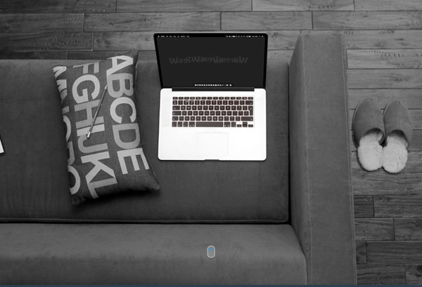

<!DOCTYPE html>
<html>
	<head>
		<title>
		</title>
	</head>
<body>
<h1>Markdown</h1>

 Ini adalah tugas pertama saya dalam membuat Markdown, awalnya saya merasa sangat sulit 
namun setelah di coba ternyata bisaa..

</body>
</html>